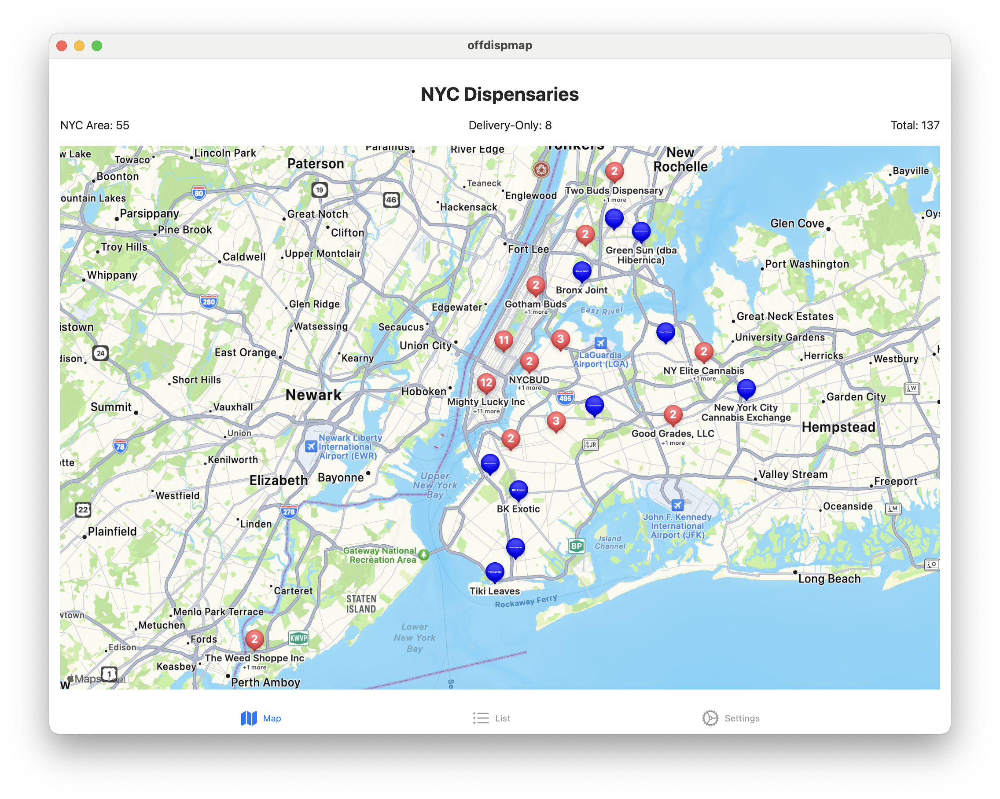

Off(icial) Disp(ensary) Map
==================

NY has made the officially licensed dispensaries available on the web
at https://cannabis.ny.gov/dispensary-location-verification

This app parses that data and plots it on a map.

So you can look at it

# Release Checklist

## App Development
- [x] Ensure all planned features are implemented and working correctly
- [x] Remove any debug/development-only features or views
- [x] Persist fetched data in core data
- [ ] Regularly attempt to refresh dispensary data in the background
- [ ] Think about forward compatibility if upstream data changes format in a
  silent way (ie, don't override valid, cached data with invalid newly-parsed
  data)
- [ ] Embedded Safari view bugs
    - [ ] crash when clicking link with no network
    - [ ] weird bottom visual artifacts when open
- [ ] Test thoroughly on multiple devices and iOS versions
- [ ] Optimize app performance and fix any crashes or bugs

## Design and UI/UX
- [ ] Ensure UI is polished and follows iOS design guidelines
- [ ] Prepare app icon in all required sizes
- [ ] Create attractive screenshots for App Store listing (including iPhone and iPad if applicable)
- [ ] Design an app preview video (optional but recommended)

## App Store Connect Setup
- [ ] Create an App Store Connect account if you haven't already
- [ ] Set up your app's basic information in App Store Connect
- [ ] Prepare privacy policy URL
- [ ] Fill out App Privacy information (types of data collected, used, etc.)
- [ ] Set up in-app purchases if applicable

## Content and Legal
- [ ] Write compelling app description
- [ ] Choose appropriate categories for your app
- [ ] Determine age rating
- [ ] Ensure compliance with Apple's App Store Review Guidelines
- [ ] Prepare all necessary legal agreements and disclaimers

## Technical Requirements
- [ ] Archive your app using Xcode
- [ ] Ensure you're using the correct provisioning profile and certificates
- [ ] Validate the app archive in Xcode
- [ ] Test the production/release build on a physical device

## Submission Process
- [ ] Upload the build to App Store Connect using Xcode or Application Loader
- [ ] Fill out all required metadata in App Store Connect
- [ ] Add build to a new version in App Store Connect
- [ ] Submit the app for review

## Post-Submission
- [ ] Prepare for potential rejection and be ready to make changes if required
- [ ] Plan your app marketing strategy
- [ ] Set up app analytics to track performance after launch

## Optional but Recommended
- [ ] Set up TestFlight for beta testing before full release
- [ ] Localize your app for different markets if applicable
- [ ] Prepare a press kit for marketing purposes

Remember to review Apple's most current [App Store Review Guidelines](https://developer.apple.com/app-store/review/guidelines/) before submission.
